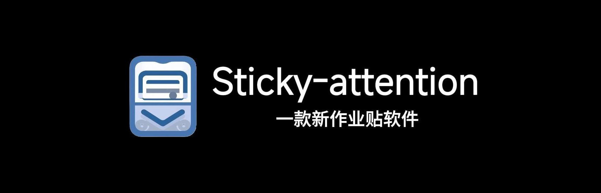
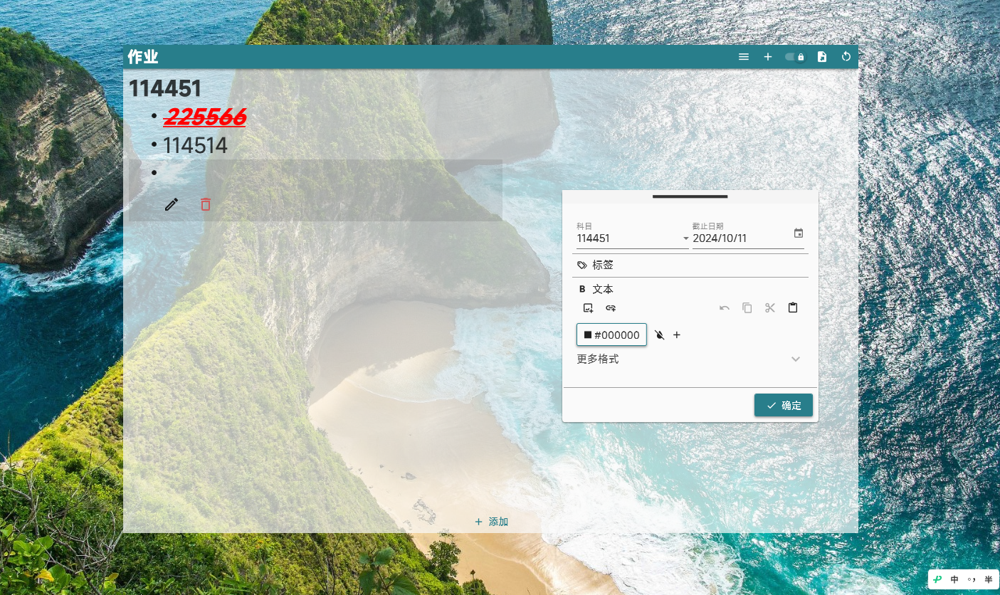
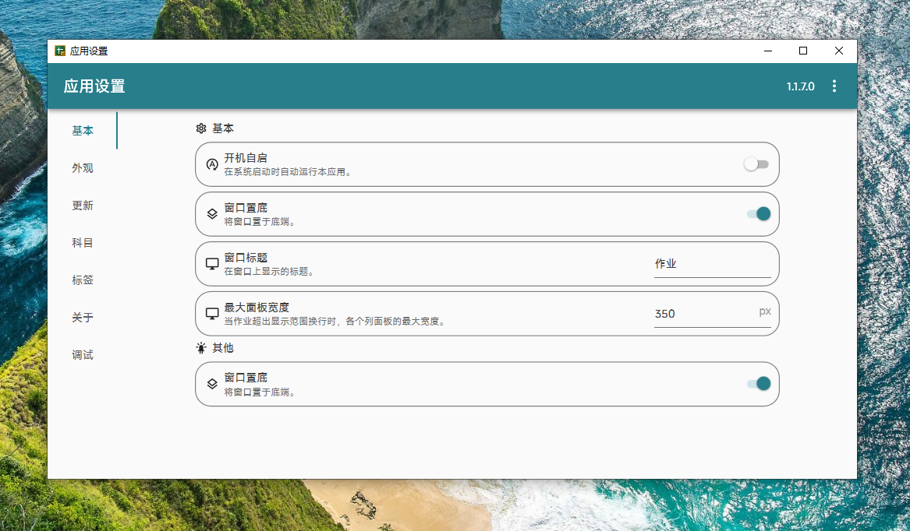

 

Sticky-attention 是一款适用于Windows 系统教室一体机的作业显示工具，可以展示各科作业等信息，后续将添加更多新内容。

#### **💬[点我加入Sticky-attention QQ 群](https://pd.qq.com/s/grr6qwqwj)**

###### [ 观看宣传片视频，了解作者是怎么发癫的 →](https://bilibili.com/video/BV1YJ4Fe5EgD/)

## 软件截图

> 软件图片来自 [jizilin6732](https://GitHub.com/jizilin6732)

### 主界面

### 设置界面

## 功能

> [!TIP]
>
> 您可以点击链接查看 [Sticky-attention 介绍视频](https://bilibili.com/video/BV11exqeiEwf/) 了解本软件的使用。
> 
- [X] 布置与修改作业
- [X] 富文本支持（字体及其大小、颜色等）
- [X] 按科目分类，科目预设
- [X] 为作业添加标签
- [X] 主界面全局缩放
- [X] 自动清理过期作业
- [X] 导出作业面板截图
- [x] 支持软件自动更新
- [x] 界面圆角
- [x] 图片插入功能
- [ ] 重构应用

## 开始使用

### 1.检查设备需求

**首先，请确保您的设备满足以下推荐需求：**
> [!warning]
> - Windows 10 及以上版本的系统，x64架构
> - 已安装[.NET 8.0桌面运行时](https://dotnet.microsoft.com/zh-cn/download/dotnet/thank-you/runtime-desktop-8.0.1-windows-x64-installer)

### 2.下载软件压缩包

对于普通用户，您可以在以下通道下载本软件，请根据自身网络环境选择合适的渠道。

> 测试版包含最新的功能，但也可能包含未完善和不稳定的功能，请谨慎使用。

| **下载通道** | **🚀正式版**    | **🚧测试版**   |
| -- | -- | -- |
| **GitHub** | [**GitHub下载**](https://github.com/Sticky-attention/Sticky-attention/releases/latest) | [**GitHub下载**](https://github.com/Sticky-attention/Sticky-attention/releases) |

<!-- > GitHub Releases 还没有同步历史版本。要下载历史版本，请前往[AppCenter](https://install.appcenter.ms/users/hellowrc/apps/classisland/distribution_groups/public/releases/latest)。 -->

### 3.使用软件

下载完成后，将软件压缩包解压，运行安装程序，安装后即可开始使用。

> [!Important]
> **本软件不能直接安装在Program Files与Program Files (x86)文件夹下，否则启动软件必须用管理员权限打开，同时开机自启失效！（软件也会报错）捏**
> ##### 点击下方链接 即可一步步教你安装Sa(Sticky-attention)
> 

## 遇到问题
如果您确定您遇到的问题是 Bug，或者您要提出新的功能，您可以：
- 在[`QQ群｜680019081`](https://qm.qq.com/q/neHPnfBSJq)中交流
- 提交 [`Issue`](https://github.com/Sticky-attention/Sticky-attention/issues)

## 开发

本应用目前的开发状态：

- 正在[`master`](https://github.com/Sticky-attention/Sticky-attention/tree/master)分支上开发本应用。
- 正在[`更新`](https://github.com/Sticky-attention/Sticky-attention/tree/更新)分支上开发本应用。

要在本地编译应用，您需要安装以下负载和工具：
- [.NET 8.0 SDK](https://dotnet.microsoft.com/zh-cn/download/dotnet/8.0)
- [Visual Studio](https://visualstudio.microsoft.com/)

对于Visual Studio，您需要在安装时勾选以下工作负载：
- **.NET 桌面开发**

我们欢迎想要为本应用实现新功能或进行改进的同学提交 [Pull requests](https://github.com/Sticky-attention/Sticky-attention/pulls)。

## 许可证

本项目基于 [General Public License v3](LICENSE.txt) 获得许可。

## Stars 历史

如果这个项目对您有帮助，请点亮 Star ⭐

